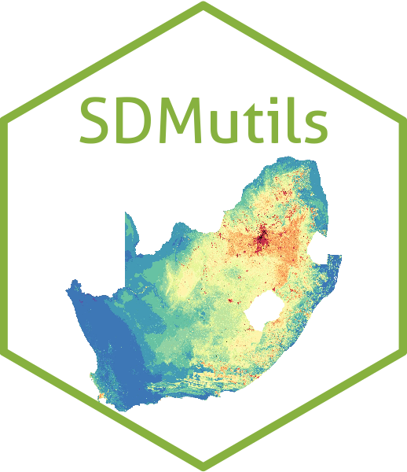

```{r setup, include=FALSE}
knitr::opts_chunk$set(echo = FALSE)
```

# SDMutils 

This package provides a set of commonly used functions that are used to summarise occurrence records in both space and time, identify outliers, prepare data for SDM input, and write output files from the various SDM steps in a standardised format.

## Installation

To install from GitHub using the [remotes](https://github.com/r-lib/remotes) package, run:

`remotes::install_github("DomHenry/SDMUtils")`

## Functions currently available

```{r}
list.files("R")
```
